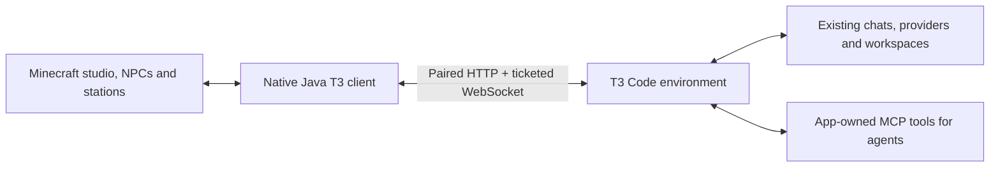

# Native T3 Code integration

## Sources and transport

Official repository: **[pingdotgg/t3code](https://github.com/pingdotgg/t3code)**.

Inspected source commit: `250e052f44dd313b658abebc707242a7b25be340`.
Verified running app on 2026-10-05: `0.0.46-nightly.20261005.2667`, orchestration protocol 2.

- [Environment authentication](https://github.com/pingdotgg/t3code/blob/250e052f44dd313b658abebc707242a7b25be340/docs/internals/environment-auth.md)
- [HTTP API contracts](https://github.com/pingdotgg/t3code/blob/250e052f44dd313b658abebc707242a7b25be340/packages/contracts/src/environmentHttp.ts)
- [Orchestration protocol 2](https://github.com/pingdotgg/t3code/blob/250e052f44dd313b658abebc707242a7b25be340/packages/contracts/src/orchestrationV2.ts)
- [Built-in MCP server](https://github.com/pingdotgg/t3code/blob/250e052f44dd313b658abebc707242a7b25be340/docs/orchestration-v2/orchestrator-mcp-server.md)
- [MCP credential middleware](https://github.com/pingdotgg/t3code/blob/250e052f44dd313b658abebc707242a7b25be340/apps/server/src/mcp/McpHttpServer.ts)

The inspected MCP endpoint accepts live provider-session credentials. Those are unsuitable as a durable independent Minecraft login. T3Craft uses T3's paired-client auth and native HTTP/RPC routes instead. This reaches the user's existing conversations directly while allowing T3's agents to continue using the app-owned MCP tools.

The paired Java client is adapted under MIT from [maxwellyoung/t3craft](https://github.com/maxwellyoung/t3craft), commit `56676d33fb24e12ce0ef22cb048753c8c2a78056`. Its separate office, server, world-control MCP and automation features were excluded. [Attribution](../THIRD-PARTY-NOTICES.md) and its license ship in the JAR.

## Architecture

There is no Node bridge, Foreman runtime, embedded Claude SDK or simulated-chat source. The retained studio snapshot structures are an internal rendering projection of T3 state; they do not perform orchestration.

## Authentication and history

Pairing exchanges a one-time environment-bootstrap link for a client credential scoped to `orchestration:read orchestration:operate`. The credential is saved in Minecraft's private `config/t3craft.json`. Windows ACLs restrict the configuration to its owner; replacement is atomic. The installer issues a new authorized pairing grant through the installed T3 CLI instead of extracting an existing app session.

The client checks public environment metadata, sends `x-t3-orchestration-protocol: 2`, loads the shell and selected bounded thread projection, and subscribes through a one-time WebSocket ticket. Long-lived access credentials do not appear in socket URLs.

Older history loads through the opaque cursor from the bounded projection and subsequent history pages. The sidebar currently excludes archived chats. No raw provider transcript directories or local mod chat database are consulted.

Protocol 1 compatibility paths are retained from the adapted client and covered by fixtures separately; protocol 2 is the live verified target. T3's rapidly changing client RPC surface is not a guarantee of compatibility with future versions.

## Feature coverage

| Feature | Native Minecraft behavior |
| --- | --- |
| Existing chats | All loaded unarchived T3 chats in a scrollable, machine/project-filtered sidebar |
| Saved history | Recent messages and paged older saved timeline |
| Explicit New chat | First send creates a new thread in the selected T3 project/workspace |
| Replies during a run | Queue after that chat's active run |
| Models/providers | Catalog from the owning machine; model selection on send |
| Stop | Interrupts the selected chat's actual active run |
| Questions | Single/multiple choice, allowed free text, multi-question requests |
| Approvals | Explicit yes/no, revalidated and routed to the exact request |
| Interaction/permission modes | Rename, Chat/Plan and T3 runtime modes |
| Activity | Actual projected command/tool receipts and outcomes |
| Checkpoint review | Latest ready checkpoint, file/hunk navigation, feedback to existing chat |
| Notifications | Completion/failure/needs-response HUD, sound and toast |
| Machines | Pair, retry, replace and remove, independent health/routing |
| NPCs | Six global desk slots, stable per-world assignments, own-desk typing, waiting approach, completion/error effects and new-reply speech |
| Task wall / board | All loaded chats with independent lane pagination; cards open their exact T3 chat |
| Monitors / terminal | Each resident's bounded messages and receipts; shared chat-status feed and native composer |
| History library | Searchable saved-chat catalog; shelves open the selected chat's history |
| Checkpoint station | Known ready checkpoints on physical cards; exact-chat review and full review catalog |
| Atrium / beacon / lamps | Real studio totals, selected-chat status, per-machine connection health and offline lighting |
| Archived chats / fork / archive controls | Still in T3 Code; native controls pending |
| Reasoning effort and provider-specific options | Existing selections inherited; native option editors pending |
| Steer active run / queue management | Native queue-on-reply implemented; explicit steering and queue editing pending |
| Attachments / interactive terminal | Still in T3 Code; native controls pending |
| New worktree authoring / handoff | Existing workspace inherited; native authoring pending |
| Scheduler / delegated task management | Existing activity visible; native management pending |
| Git/PR create, publish, merge and watch | Still in T3 Code; checkpoint review is available |

The current integration is usable for chat and review. Complete T3 feature parity in Minecraft remains unfinished; the pending rows above are the remaining implementation scope.

## Verification

Plain-JVM checks exercise the production Java paired client against two isolated loopback fixtures. They cover identity/owner routing, stale requests, reconnects, protocol negotiation, pairing exchange, model changes, existing-chat replies, explicit creation, settings and checkpoint diffs. Write checks run only against fixtures.

The live probe reads the real paired T3 environment and verifies the socket subscription and provider catalog, without creating chats or sending messages. Minecraft development-client QA verified the native panel with 150 existing chats and six HQ residents. Isolated in-game checks verified own-desk typing, exact-request waiting approach, completion particles, return to the lounge, failure, offline lights, a healthy peer machine, recovery and native station screens. The HQ check found 68 reachable routes and no NPC path failures; it still reports six routes that step over furniture in the original layout.

`studioCheck` covers the full-history task/library/feed projection, per-desk content, absent bindings, offline provenance and speech replay suppression. `officeCheck` covers the global six-desk capacity across machines and persisted slot identity. The snapshot regression verifies that pending request details load even with every panel closed. Write checks run against fixtures only.

The native Prism instance now launches successfully. Its log confirms the generated HQ and all six residents, and the user's screenshot shows the connected T3 task wall. That startup recorded Marlow teleporting after failed paths; the earlier zero-failure result applies to the isolated development scenario and does not establish every native navigation route. The wall update keeps the complete loaded chat catalog on independently paged, full-size cards with T3 status labels and project context.

Read-only wall QA in the development game retained all 150 real chats and traversed the 149 idle chats across 50 physical pages through actual use-key clicks. It verified both navigation boundaries, Previous, full-size cards and native card opening. The build and plain-JVM pagination checks passed; the portable ZIP matches that build and contains no pairing/account configuration or fixed Java path. After the user closed Minecraft, the wall build was installed into the native Prism instance. Its installed JAR matches the verified build, and the private T3 configuration hash is unchanged. The wall update still needs its first native Prism relaunch.

See [developer commands](../tools/README.md) and [the user guide](USER-GUIDE.md).
